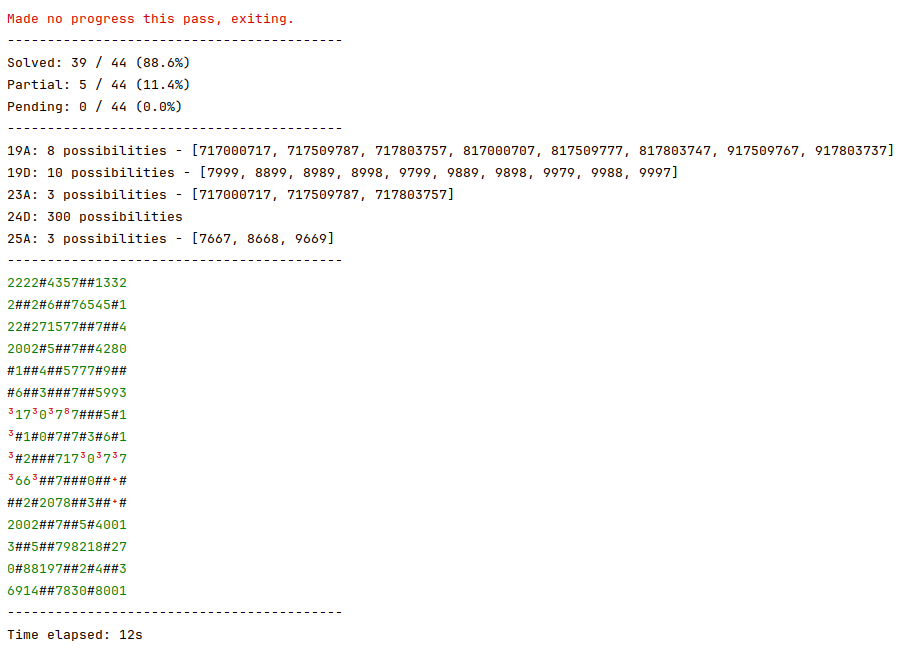
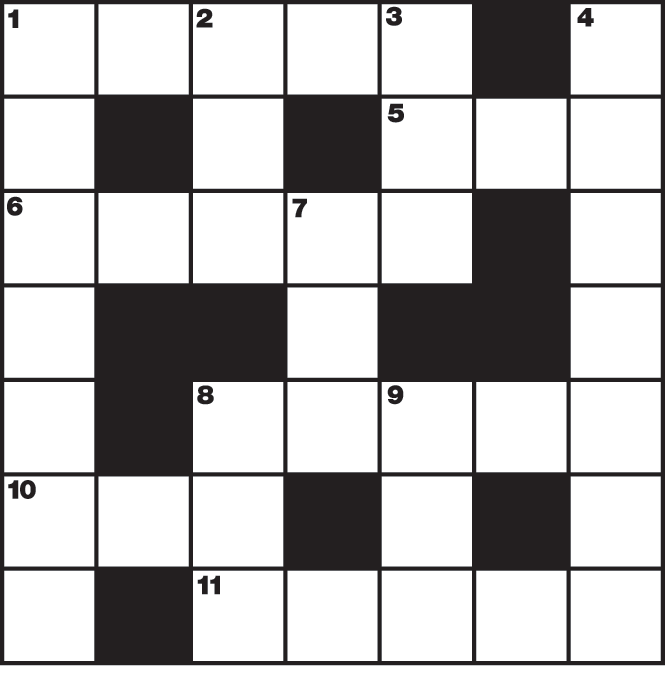

## Crossnumber Solver

Generic solver for crossnumber puzzles - find them all here: https://chalkdustmagazine.com/category/regulars/crossnumber/

### How do I run it?

You'll need a version of Java installed. Then, from the root of the repo simply run e.g.:

```shell
./gradlew solve -Puzzle=3
```

### How it works

The solver makes repeated "passes" over each of the clues in turn, attempting to make progress. 

For each clue, it will carry out the following steps:

1. Restrict potential solutions based on what we know from our "digit map". 
2. Run through our potential solutions and apply all the clue(s) we have.
3. Update our digit map based on the reduced list

It keeps going until the crossnumber is solved or no more progress is being made. In the latter case, the grid is printed along with the state of all unsolved clues:



### No hard-coding!

To make the solver as authentic as I can, I am avoiding hardcoding answers wherever possible - even when it might be tempting for performance reasons.

For example, consider this clue from [Crossnumber 2](https://chalkdustmagazine.com/regulars/crossnumber/100-prize-crossnumber-issue-02/):

> 22. The smallest number with a (multiplicative) persistence of 11. (15)

This can simply be looked up in OEIS - the sequence is [A003001](https://oeis.org/A003001). Despite this, my solution instead derives the answer:

```kotlin
    "22A" to smallest(simpleClue(hasMultiplicativePersistence(11)))
```

This obviously slows the solver down, although various strategies allow it to not go _too_ slowly. In particular, it will defer long clues like these until it stops making progress elsewhere, hopefully allowing it to have narrowed down some digits to reduce the search space.

It's also possible to kick off "async work" in parallel to save time, for instance for this clue:

> 36. The number of primes less than 100,000,000. (7)

Again, I could compute this once then hardcode it, but instead this solution does the following:

```kotlin
    "36A" to asyncEquals { countPrimesUpTo(100_000_000).toLong() }
```

This begins the computation immediately, but allows the solver to otherwise get on with working on other clues. Like with numbers with lots of digits, it will defer waiting for this work until it stops making progress elsewhere.

### No hard-coding - exceptions

There are, of course, some exceptions to the hard-coding rule.

#### Pop culture/trivia

Clues like:

 - The answer to the ultimate question of life, the universe and everything
 - The HTTP error code for “I’m a teapot”
 - Why is 6 afraid of 7?

I could _arguably_ use API requests or something to look these answers up, but I don't want the solver to require an internet connection.

#### Prohibitively complex

Clues like:

 - The number of ways to play the first 3 moves (2 white moves, 1 black move) in a game of chess
 - A Sierpiński number.

In the first case, to directly compute this I'd basically have to write a full chess sim, which would be another project in itself!
In the latter case, there is no straightforward test for a Sierpinski number - in fact, though there is an OEIS [sequence](https://oeis.org/A076336), it's not known to be complete and there are various open problems around them. Perhaps one day a new one will be discovered which renders this crossnumber non-deterministic!

### Input / Usage

To see full examples, take a look at any of the complete puzzles [here](src/main/kotlin/puzzles)

#### Grid

The grid should be input as a String, with # representing black squares and . representing white squares - for example:



```kotlin
val grid = """
    ......#
    .#.#.#.
    .......
    .##.##.
    .......
    .#.#.#.
    #......
""".trimIndent()
```

The solver will automatically validate that the grid is square and has rotational symmetry to help catch typos. It will
also compute what the expected clue identifiers are - in this case the across clues are 1A, 5A, 6A, 8A, 10A and 11A.

#### Clues

The other data to be provided are the clues themselves, which should be provided as a map. 
Many types of clues exist; all the most common cases should be possible to capture using various helpers. 
Clues can also be combined using the + operator.

Here are some examples:

```kotlin
val clueMap: Map<String, ClueConstructor> = clueMap(
    // 4D multiplied by 18D
    "1A" to dualReference("4D", "18D", Long::times),
    
    // A multiple of 101
    "5A" to simpleClue(isMultipleOf(101)),
    
    // A palindromic number containing at least one 0
    "9A" to simpleClue { value -> isPalindrome(value) && containsDigit(0)(value) },
    
    // A factor of 6D - this also generates the reciprocal clue (that 6D is a multiple of 19A)
    *"19A".isFactorOf("6D"),
    
    // This number is both square and tetrahedral.
    "39A" to simpleClue(::isSquare) + simpleClue(::isTetrahedralNumber),
    
    // The sum of this number’s digits is 16A. This generates the reciprocal too
    *"8D".transformedEquals("16A", ::digitSum)
)
```

### Results

Below are the crossnumbers this can solve so far, along with roughly how long each solve takes:

| #   | Time (s) | URL                                                                                |
|-----|----------|------------------------------------------------------------------------------------|
| 1   | 15       | https://chalkdustmagazine.com/regulars/100-prize-crossnumber-issue-01/             |
| 2   | 30       | https://chalkdustmagazine.com/regulars/crossnumber/100-prize-crossnumber-issue-02/ |
| 3   | 25       | https://chalkdustmagazine.com/regulars/crossnumber/prize-crossnumber-issue-03/     |
| 4   | 15       | https://chalkdustmagazine.com/regulars/crossnumber/prize-crossnumber-issue-04/     |
| 5   | 10       | https://chalkdustmagazine.com/regulars/crossnumber/prize-crossnumber-issue-05/     |
| 6   | 5        | https://chalkdustmagazine.com/regulars/crossnumber/prize-crossnumber-issue-06/     |
| 7   | 90       | https://chalkdustmagazine.com/regulars/crossnumber/prize-crossnumber-issue-07/     |
| 8   | 5        | https://chalkdustmagazine.com/regulars/crossnumber/prize-crossnumber-issue-08/     |
| 9   | 20       | https://chalkdustmagazine.com/regulars/crossnumber/prize-crossnumber-issue-09/     |
| 10  | 20       | https://chalkdustmagazine.com/regulars/crossnumber/prize-crossnumber-issue-10/     |
| 11  | 15       | https://chalkdustmagazine.com/regulars/crossnumber/prize-crossnumber-issue-11/     |
| 12  | 0        | https://chalkdustmagazine.com/regulars/crossnumber/prize-crossnumber-issue-12/     |
| 13  | 3        | https://chalkdustmagazine.com/regulars/crossnumber/prize-crossnumber-issue-13/     |
| 14  | 0        | https://chalkdustmagazine.com/regulars/crossnumber/prize-crossnumber-issue-14/     |
| 15  | N/A      | https://chalkdustmagazine.com/regulars/crossnumber/prize-crossnumber-issue-15/     |
| 16  | 3        | https://chalkdustmagazine.com/regulars/crossnumber/prize-crossnumber-issue-16/     |
| 17  | 25       | https://chalkdustmagazine.com/regulars/crossnumber/prize-crossnumber-issue-17/     |
| 18  | 20       | https://chalkdustmagazine.com/regulars/crossnumber/prize-crossnumber-issue-18/     |
| 19  | 0        | https://chalkdustmagazine.com/regulars/crossnumber/prize-crossnumber-issue-19/     |
| 20  | 0        | https://chalkdustmagazine.com/regulars/crossnumber/prize-crossnumber-issue-20/     |
| 21  | 60       | https://chalkdustmagazine.com/regulars/crossnumber/prize-crossnumber-issue-21/     |
| 22* | 1        | https://chalkdustmagazine.com/regulars/crossnumber/prize-crossnumber-issue-22/     |

*Not pushed to the repo yet (competition still active)